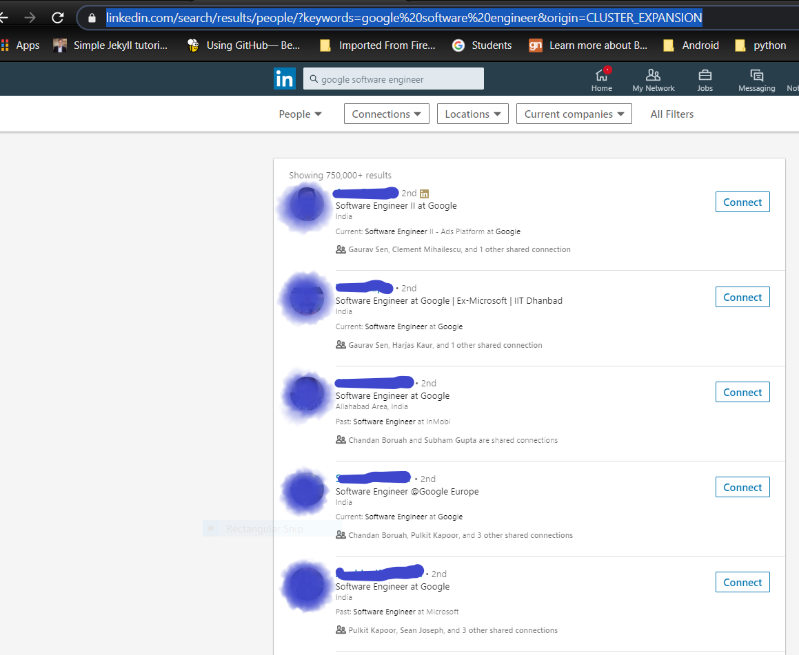

I know what your question will be -- Why do you want to scrape websites using Javascript? This is becuase, in software engineering, it's not about what language you choose, its more about how you use logic to solve problems given certain constraints.

As I am learning Javascript so I decided to put a constraint on myself and try to scrape a website to solidify whatever I have learnt this past week and try to scrape LinkedIn.

## Goal 
The goal of this tutorial is to scrape LinkedIn for the top 5 profiles that LinkedIn shows when the user provides a search string and save the individual profile pages as a .txt file in your local file system.Here, we will learn about</br>

## What you will learn
1. Perform actions inside the browser, that we usually do with our mouse, through code.
2. Automate form submission.
3. Learn to save files to our local file system.  


## Prerequisites
This tutorial is aimed to be biginner friendly. If you are following along, you would need to install [NodeJS](https://nodejs.org/en/) in your PC.
The source code with be available in the given repository :<br>
[Github repo](https://github.com/shanudjn/Web-Scraping-with-NodeJS)

## Dependencies
1. ### Puppeteer     
    > Puppeteer is a Node library which provides a high-level API to control headless Chrome or Chromium over the DevTools Protocol. It can also be configured to use full (non-headless) Chrome or Chromium.</br>
    > It means that Puppeteer provides us with functions through which we can run Chrome or Chromium. We can emulate all the actions which we do in a browser like going to a link, clicking a button etc. without the GUI but through code.  
2. ### Cheerio
    >Cheerio is subset of core jQuery which is basically used to do DOM manipulations.
3. ### File-System
    >It is a Node.js module that allows you to work with the file system of your computer.

## Project Setup

1. Create a folder.<br/>
2. Open the folder from your terminal. Make sure you have NodeJS installed.<br/>
3. In your terminal, run  `npm init`. This will create a `package.json` file inside your folder.

## Installing the dependencies
As we have three dependencies, we need to install them. Run the following commands in the terminal.</br>
* `npm install puppeteer`
* `npm install cheerio`
* `npm install file-system`


## Breaking down the problem
Now as we are ready with all out dependencies, let us start by breaking down the project so that we can handle each individual problems and tackle it one by one. At this point, the problems which are apparent are:
1. We need to first login to LinkedIn. Therefore, we would need to automate form submission.
2. Then we would need to figure out a way to provide the search string, so that LinkedIn gives as the top 10 profiles to scrape.
3. Then we would need to search for the profile links of the individual profile from the search results.
4. Go to the individual profile links and save the pages to our file system.


As we have figured out the apparent problems let us dive into the code.

1. ### Logging into LinkedIn
    At first we go to the LogIn page where wefind the selectors for our username and password, open chrome developer tools `ctrl+shift+i`.
    After inspecting the username and password firld we see that the filed are assigned an id.
    Remember if you are struggling with the code, the link to the repository is given above.
    Have a look at the picture below : </br>
    <br/>

    Create a file named scrape.js and add the following code.   


```js
    //importing the dependencies

    let puppeteer = require("puppeteer");
    let cheerio = require("cheerio");
    let fs = require("file-system");

    var links = [];
    var page;


    
    const EMAIL_SELECTOR = "#username";
    const PASSWORD_SELECTOR = "#password";
    const SUBMIT_SELECTOR = "#app__container > main > div > form > div.login__form_action_container > button";
    const LINKEDIN_LOGIN_URL = "https://www.linkedin.com/login?fromSignIn=true&trk=guest_homepage-basic_nav-header-signin";    
    const SEARCH_STRING = process.argv[2];
    
    //main
    if (process.argv[2] !== undefined) {
    (() => {
        puppeteer
        .launch({ headless: true })
        .then(async (browser) => {
            page = await browser.newPage();
            page.setViewport({ width: 1366, height: 768 });
            await page.goto(LINKEDIN_LOGIN_URL, { waitUntil: "domcontentloaded" });

            await page.click(EMAIL_SELECTOR);
            //enter your email in the next line
            await page.keyboard.type("your@email.com");
            await page.click(PASSWORD_SELECTOR);
            //enter your password in the next line
            await page.keyboard.type("password");
            await page.click(SUBMIT_SELECTOR);
        })
        .catch((err) => {
            console.log(" CAUGHT WITH AN ERROR ", err);
        });
    })();
}


```
Here, what's going on is that we launch a browser. The code then takes the browser to the LinkedIn Login Url and enters the username and password.
Do not forget to change to your username and password in the above code.
If you change headless to false in the above code, you can see a chromium browser open and login to your account automatically.

2. ### Entering the search string.
After logging in, the next step we need to do is to find a way to enter the search string.
After doing some digging, I found that for getting the list of profiles based on your search string we could use a url. Look at the image below:</br>

So, to get the list of profiles add the following code to the previous code i.e. after <br/> `await page.click(SUBMIT_SELECTOR);`, add the following code to go to the list page.
```js
        await page.goto(
          `https://www.linkedin.com/search/results/people/?keywords=${SEARCH_STRING}&origin=CLUSTER_EXPANSION`,
          { waitUntil: "domcontentloaded" }
        );
```
 

3. ### Finding the profile links.
Now we are almost at the end of the tutorial, here we just need to find the profile links to all the results we get after we enter the search string:

Add the following function to your code :
```js
//helper function get the profile links from the target page 
async function getDataFromPage() {
  const content = page.content();
  return content
    .then((success) => {
      const $ = cheerio.load(success);
      let divClass = $(".search-results__list").find("li");
      //console.log(divClass.attr('class'));
      let listLength = divClass.length;
      //console.log(listLength);
      divClass.each(function (i, element) {
        const targetUl = $(element).find(
          ".search-result__info,.pt3, .pb4, .ph0"
        );
        //console.log(targetUl.attr('class'));
        const name = $(targetUl).find(".name, .actor-name").text();
        const link = $(targetUl).find("a").attr("href");
        links.push(link);
      });
      return links;
    })
    .catch((err) => {
      console.log(" CAUGHT WITH AN ERROR ", err);
    });
}
```
What the above code does is it selects the profile links with the help of the selectors and add it to an array named links.
Then we make a function call to the above function.
Add the following lines into the main code<br/>
```var data = await getDataFromPage();```

4. ### Going to the individual profile links and save the pages to our local system.
After add the line from the above point, add the following lines of code.
```js
for (let i = 0; i < data.length; i++) {
          //console.log("Link " + i + " : " + data[i]);
          let newPage = await browser.newPage();
          let newurl = "https://www.linkedin.com" + data[i];
          await newPage.goto(newurl, { waitUntil: "networkidle2" });
          let childHtml = await newPage.content();
          fs.writeFile(`file${i}.txt`, childHtml);
          //console.log(childHtml);
          newPage.close();
}
```
The above code loops through the links array and goes to the individual profile pages. We save the pages in the form of an .txt file. One thing to rememeber, that it is always a good practice to close the headless browser after scraping. So, add the following line to close the browser after the for loop.<br/>
```browser.close();```


With this we are done with our code. To run it, in your terminal navigate to your project directory and type the following in ``` node scrape "your search string" ```.

And keep in mind that you can always check the github repo for reference.


